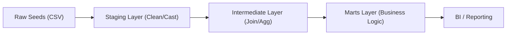

# E-Commerce Analytics Platform (dbt + DuckDB)

## 1. Project Overview
This repository contains a modern data transformation pipeline built with **dbt (data build tool)** and **DuckDB**. The goal is to transform raw e-commerce transactional data into clean, business-ready analytical models using a modular architecture.

The project demonstrates:
* **ELT Best Practices:** Staging → Intermediate → Marts layering.
* **Advanced Modeling:** Incremental models, Snapshots (SCD Type 2), and Custom Macros.
* **Data Quality:** Comprehensive testing (generic & singular) and documentation.
* **Performance:** Optimized materialization strategies.

---

## 2. Architecture & Design

### High-Level Data Pipeline
The architecture follows the Medallion Architecture pattern, ensuring that business logic is abstracted into the Intermediate layer, keeping the Marts clean and performant for BI tools.


### Tech Stack
1. Orchestration & Transformation: dbt Core (v1.8+)
2. Data Warehouse: DuckDB (Serverless, local OLAP database)
3. Language: SQL (DuckDB dialect) & Jinja2
4. Version Control: Git

### Data Modeling Approach
I utilized Dimensional Modeling (Star Schema) for the final marts to ensure compatibility with BI tools (Tableau, Looker, PowerBI) and ease of use for end-users.
**Fact Tables:** fct_orders (Transactional events).
**Dimension Tables:** dim_customers (Descriptive attributes).
**Aggregate Marts:** mart_product_performance, mart_monthly_revenue (Pre-calculated metrics for dashboards).

### Key Design Decisions
1. DuckDB as Warehouse: Chosen for its speed on local development and ability to handle analytical queries on CSVs without infrastructure overhead.
2. Incremental Strategy: fct_orders is configured as incremental. In a real-world scenario, order tables grow indefinitely. This strategy processes only new data (based on order_date), significantly reducing compute costs.
3. SCD Type 2 (Snapshots): Implemented on the products table to track cost changes over time, preserving historical accuracy for revenue reporting.
4. Assumptions:
Cost Calculation: Raw data lacked a 'cost' column in some versions, so a 60% standard cost model was applied in mart_product_performance.
Currency: All monetary values are assumed to be in USD.

## 3. Setup & Installation

### Prerequisites
1. Python 3.9+
2. Git

### Step-by-Step Instructions

1. Clone the Repository
```bash
git clone <your-repo-url>
cd ecommerce-analytics-dbt
```

2. Set up Virtual Environment
```bash
python3 -m venv venv
source venv/bin/activate
pip install dbt-duckdb
```

3. Load Raw Data (Seeds)
```bash
dbt seed
```
This creates the local DuckDB database file and loads the CSVs.

4. Run the Pipeline
```bash
dbt run
```

5. Run Tests
```bash
dbt test
```

6. Generate Documentation
```bash
dbt docs generate
dbt docs serve
```

## 4. Analytical Models (Marts)

1. Customer Lifetime Value (dim_customers)
Provides a 360-degree view of customers, including lifetime revenue, order counts, and segmentation.

2. Product Performance (mart_product_performance)
- Aggregates sales by product to calculate:
- Return Rate: (Total Returns / Total Sold)
- Gross Profit: (Revenue - Cost)
- Profit Margin: (Profit / Revenue)

3. Monthly Revenue Trends (mart_monthly_revenue)
Time-series aggregation for executive dashboards showing Monthly Active Users (MAU) and Revenue Growth.

4. Orders Fact (fct_orders)
The central transactional table linking customers, products, and return status.

## 5. Sample Analysis & Output

**Example 1 - Customer Lifetime Value:**
   ```sql
   SELECT
     customer_id,
     email,
     customer_segment,
     total_orders,
     total_revenue,
     avg_order_value,
     first_order_date,
     last_order_date,
     days_since_last_order
   FROM {{ ref('dim_customers') }}
   WHERE customer_segment = 'Premium'
   ORDER BY total_revenue DESC;
   ```
**Sample Output**
| customer_id | email                | customer_segment | total_orders | total_revenue | avg_order_value | ... |
| ----------- | -------------------- | ---------------- | ------------ | ------------- | --------------- | --- |
|          17 | quinn.lewis@email... | Premium          |            4 |           731 |          182.75 | ... |
|          23 | wendy.scott@email... | Premium          |            3 |           698 |          232.67 | ... |
|          32 | felix.turner@emai... | Premium          |            3 |           678 |          226.00 | ... |
|           5 | emma.davis@email.com | Premium          |            4 |           604 |          151.00 | ... |
|           3 | carol.white@email... | Premium          |            4 |           559 |          139.75 | ... |

**Example 2 - Product Performance with Returns:**
   ```sql
   SELECT
     product_id,
     product_name,
     category,
     total_quantity_sold,
     total_revenue,
     total_returns,
     return_rate,
     gross_profit,
     profit_margin
   FROM {{ ref('mart_product_performance') }}
   WHERE return_rate > 0.10
   ORDER BY return_rate DESC;
   ```
**Sample Output**
| product_id | product_name        | category    | total_quantity_sold | total_revenue | total_returns | ... |
| ---------- | ------------------- | ----------- | ------------------- | ------------- | ------------- | --- |
|        118 | Standing Desk       | Furniture   |                  12 |       3,239.0 |             6 | ... |
|        113 | Monitor             | Electronics |                  21 |       4,112.0 |             9 | ... |
|        102 | Mechanical Keyboard | Electronics |                   9 |         420.5 |             2 | ... |
|        106 | Ergonomic Chair     | Furniture   |                   6 |         741.0 |             1 | ... |

**Example 3 - Order Facts with Dimensions:**
   ```sql
   SELECT
     order_id,
     order_date,
     customer_email,
     customer_segment,
     order_status,
     total_items,
     total_quantity,
     subtotal,
     is_returned,
     days_to_return
   FROM {{ ref('fct_orders') }}
   WHERE is_returned = TRUE
   ORDER BY order_date DESC;
   ```
**Sample Output**
| order_id | order_date | customer_email       | customer_segment | order_status | total_items | ... |
| -------- | ---------- | -------------------- | ---------------- | ------------ | ----------- | --- |
|     1090 | 2023-06-14 | jack.anderson@ema... | Standard         | completed    |           1 | ... |
|     1084 | 2023-06-11 | derek.perez@email... | Standard         | completed    |           1 | ... |
|     1078 | 2023-06-08 | kate.thomas@email... | Premium          | completed    |           1 | ... |
|     1072 | 2023-06-05 | felix.turner@emai... | Premium          | completed    |           1 | ... |
|     1066 | 2023-06-02 | olivia.harris@ema... | Standard         | completed    |           1 | ... |

**Example 4 - Monthly Trends:**
   ```sql
   SELECT
     DATE_TRUNC('month', order_date) as order_month,
     COUNT(DISTINCT order_id) as total_orders,
     COUNT(DISTINCT user_id) as unique_customers,
     SUM(total_amount) as total_revenue,
     AVG(total_amount) as avg_order_value
   FROM {{ ref('fct_orders') }}
   WHERE order_status = 'completed'
   GROUP BY 1
   ORDER BY 1;
   ```
**Sample Output**
| order_month | total_orders | unique_customers | total_revenue | avg_order_value |
| ----------- | ------------ | ---------------- | ------------- | --------------- |
|  2023-05-01 |           59 |               39 |      6,941.99 |        117.661… |
|  2023-06-01 |           58 |               38 |      6,780.50 |        116.905… |

## 6. Testing & Quality Assurance

Data quality is enforced via `dbt test`:

### 1. Generic Tests
* **Standard:** `unique`, `not_null` constraints on primary keys.
* **Relationships:** Referential integrity checks (e.g., `user_id` in orders exists in users).
* **Custom Generic Test:** `is_non_negative` (defined in `tests/generic/`) ensures financial columns like `total_amount` never contain negative values where invalid.

### 2. Singular Tests (Business Logic)
* `assert_total_revenue_positive.sql`: Validates that total revenue is mathematically consistent.
* `assert_return_date_after_order_date.sql`: **Logic Validation** ensuring that a return cannot happen before the original order date.

### 3. Source Freshness
* Configured in `sources.yml` to warn if data is older than 24 hours, ensuring the pipeline runs on fresh data.

## 7. Advanced Features & Analysis

This project implements several advanced analytics engineering patterns:

* **SCD Type 2 Snapshots:** Tracks changes in product costs over time in the `snapshots/` directory.
* **Incremental Models:** `fct_orders` processes only new data to optimize performance on large datasets.
* **Custom Macros:** `cents_to_dollars` logic abstracted for reusability.
* **Jinja Analysis:** An analysis file `analysis/orders_by_day_of_week.sql` demonstrates complex SQL logic that is compiled but not materialized.

---

## 8. Reflection & Future Improvements

**Time Taken:** Approximately 4-5 hours.

**Challenges:**
1.  **Schema Evolution:** The `raw_returns` schema linked to `order_item_id` rather than `order_id`, requiring a refactor of the intermediate join logic to ensure accurate fan-out handling.
2.  **Incremental Logic:** ensuring the `is_incremental()` macro correctly handled late-arriving data without duplicating records.

**Future Improvements:**
1.  **Orchestration:** Implement a GitHub Actions workflow to run `dbt run` on every Pull Request (CI/CD).
2.  **Data Quality:** Add `dbt-expectations` package for more statistical testing (e.g., expecting row counts to be within a range).
3.  **Visualization:** Connect a lightweight BI tool like Metabase or Streamlit to the DuckDB file for live charting.

## 9. Custom Macros & Packages

### `cents_to_dollars.sql`
* **Purpose:** Automates the conversion of currency stored as integers (cents) into decimals (dollars).
* **Usage:** `{{ cents_to_dollars('column_name') }}`